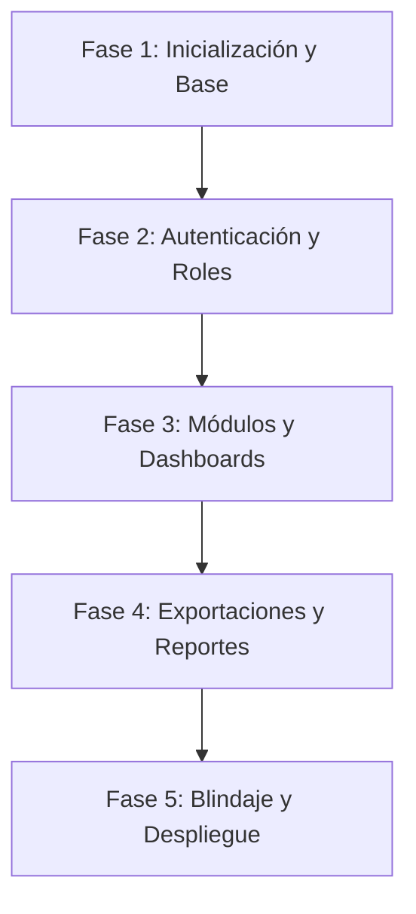

# 🚀 Plan de Acción: Plataforma Lumni (React + TypeScript + Firebase)

Este documento detalla la hoja de ruta paso a paso para construir la plataforma **Lumni** con una arquitectura profesional, escalable para miles de usuarios, segura y con **$0 MXN** de costo inicial de infraestructura.

---

## 🏗️ 1. Stack Tecnológico Seleccionado

| Componente | Tecnología | Costo | Beneficio Clave |
| :--- | :--- | :--- | :--- |
| **Framework Frontend** | React 19 + TypeScript | **$0** | Componentes reutilizables, tipado estricto sin errores y reactividad instantánea. |
| **Entorno de Compilación** | Vite | **$0** | Carga en milisegundos y empaquetado optimizado/ofuscado para producción. |
| **Diseño y Estilos** | Tailwind CSS + Lucide Icons | **$0** | Diseño visual moderno, limpio y 100% responsivo para móviles, tablets y PC. |
| **Base de Datos & Auth** | Google Firebase (Firestore + Auth) | **$0 (Spark)** | 50,000 usuarios activos mensuales y 50,000 lecturas diarias gratuitas con escalabilidad automática. |
| **Hosting & Despliegue** | Cloudflare Pages | **$0** | Tráfico y ancho de banda ilimitado con CDN global y certificado SSL (HTTPS) automático. |

---

## 🗺️ 2. Fases de Ejecución Paso a Paso



---

### 📍 Fase 1: Creación de la Estructura Base
- [x] **Inicializar el proyecto con Vite + React + TypeScript:**
  ```bash
  npm create vite@latest lumni -- --template react-ts
  ```
- [x] **Configurar Tailwind CSS y Sistema de Diseño:**
  - Paleta de colores institucional moderna.
  - Tipografía profesional (*Inter* / *Outfit*).
  - Soporte de modo claro / modo oscuro y efectos Glassmorphism.
- [x] **Configurar el cliente centralizado de Firebase SDK:**
  - Configuración en `src/config/firebase.ts` con modo Mock/Demo local automático.
  - Tipado e interfaces TypeScript estrictas para modelos de datos (`User`, `Student`, `Grade`, `Attendance`, `Notice`, `Message`, `Subscription`).

---

### 📍 Fase 2: Autenticación, Sesiones y Roles de Usuario
- [x] **Pantalla de acceso protegida:**
  - Formulario de Login seguro con validaciones en tiempo real y soporte para ocultar/mostrar contraseña.
  - Accesos rápidos de 1 clic para probar los 4 roles en modo Demo (`admin`, `teacher`, `student`, `parent`).
  - Manejo de estados de carga, persistencia de sesión (`localStorage` / Firebase Auth).
- [x] **Recuperación de contraseña:**
  - Flujo interactivo vía modal de restablecimiento de contraseña vía email (`sendPasswordResetEmail`).
- [x] **Sistema de control de acceso basado en roles (RBAC):**
  - 👑 **Administrador / Dirección:** Control total del plantel, altas/bajas de usuarios y configuración global.
  - 👨‍🏫 **Profesor:** Gestión de grupos asignados, captura de calificaciones y registro diario de asistencias.
  - 👨‍🎓 **Alumno:** Portal del Estudiante con consulta de notas trimestrales, asistencias y avisos (solo lectura).
  - 👨‍👩‍👧 **Tutor / Padre:** Portal Familiar con seguimiento del alumno, descarga de boletas y chat directo con el profesor.

---

### 📍 Fase 3: Módulos Principales de la Plataforma
- [x] **Dashboard Principal:**
  - Tarjetas de métricas y estadísticas clave en tiempo real (promedios, asistencias, avisos).
  - Accesos rápidos según el rol activo y vista de bienvenida adaptativa.
  - Centro de notificaciones y recordatorios.
- [x] **Gestión de Alumnos y Grupos:**
  - Altas, bajas, reactivaciones y edición completa de expedientes escolares con CURP oficial.
  - Búsqueda instantánea con filtros combinados por grado, grupo, turno y estatus.
  - Modal de credencial escolar digital oficial con código QR individual para cada alumno.
- [x] **Control de Calificaciones y Asistencias:**
  - Pase de lista con escáner QR en vivo utilizando la cámara del dispositivo (`html5-qrcode`).
  - Sábana interactiva de calificaciones tipo hoja de cálculo con cálculo automático de promedios ponderados y anuales.
  - Métricas de rendimiento escolar (% de aprobación y alerta de alumnos en riesgo).
- [x] **Módulo de Avisos y Comunicados:**
  - Publicación y filtrado de noticias institucionales con selección de audiencia y nivel de prioridad.
  - Canal de mensajería bidireccional y búsqueda de conversaciones docente-tutor.

---

### 📍 Fase 4: Exportaciones y Reportes Profesionales
- [x] **Generador de Boletas y Reportes en PDF:**
  - Formato membretado oficial listo para impresión y descarga directa en PDF (`jspdf` + `jspdf-autotable`).
  - Boletas individuales con desglose de materias, trimestres, promedio anual final, totales de asistencia y firmas oficiales.
- [x] **Exportación a Hojas de Cálculo (Excel .xlsx / CSV):**
  - Descarga masiva del concentrado de calificaciones trimestral y anual en formato Excel (.xlsx).
  - Descarga del concentrado de asistencias y porcentajes de puntualidad en Excel (.xlsx).
  - Padrón oficial de alumnos con CURP, matrícula y contactos de tutores en Excel (.xlsx) y CSV.

---

### 📍 Fase 5: Blindaje de Seguridad y Despliegue
- [x] **Reglas de Seguridad en Firestore (`firestore.rules`):**
  - Validación a nivel base de datos para garantizar que solo los maestros (`teacher`) puedan modificar alumnos, calificaciones, materias, asistencias, incidencias y comunicados.
  - Los tutores (`parent`) solo pueden leer información de su propio hijo y redactar mensajes en su hilo privado.
- [x] **Reglas de Seguridad en Firebase Storage (`storage.rules`):**
  - Control de subida de fotos de perfil, credenciales y adjuntos con límite de tamaño y validación MIME de imágenes y PDF.
- [x] **Configuración para Cloudflare Pages SPA:**
  - `public/_redirects`: Redirección `/* /index.html 200` para soporte de rutas sin errores 404 en recargas.
  - `public/_headers`: Encabezados de seguridad (`X-Frame-Options`, `X-Content-Type-Options`, `Permissions-Policy`).
- [x] **Compilación, Code-Splitting y Optimización de Producción:**
  - `vite.config.ts` configurado con fragmentación manual (`vendor-react`, `vendor-pdf`, `vendor-xlsx`, `vendor-qr`, `vendor-firebase`).
  - `npm run build` ejecutado exitosamente con 0 warnings y 0 errores.

---

## 🚀 Guía Rápida de Despliegue en Cloudflare Pages ($0 MXN)

1. **Subir cambios a GitHub:**
   ```bash
   git add .
   git commit -m "feat: Lumni v2.0 - 100% listo para producción"
   git push origin main
   ```
2. **Conectar con Cloudflare Pages:**
   - Ve a [dash.cloudflare.com](https://dash.cloudflare.com/) > **Workers & Pages** > **Create application** > **Pages** > **Connect to Git**.
   - Selecciona el repositorio `lumni-front-`.
3. **Configuración de Compilación:**
   - **Framework preset:** `Vite`
   - **Build command:** `npm run build`
   - **Build output directory:** `dist`
   - **Root directory:** `/`
4. **Variables de Entorno (Opcional si usas Firebase en vivo):**
   - Agrega `VITE_FIREBASE_API_KEY`, `VITE_FIREBASE_PROJECT_ID`, etc., desde tu panel de Firebase Console.
5. **Haz clic en "Save and Deploy"** y tu aplicación estará disponible globalmente con SSL automático y CDN ultrarrápida.

